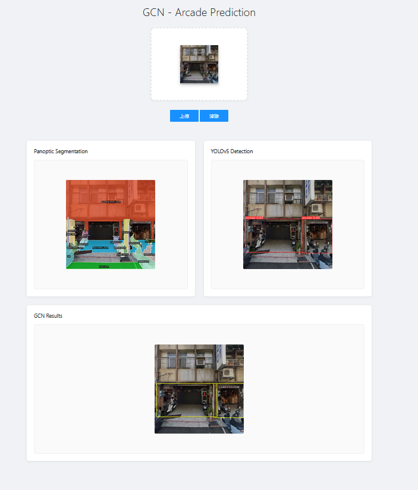

# GCN_api
This API provides an end-to-end solution for processing and analyzing images containing arcade structure. It combines multiple models and algorithms, including Panoptic Segmentation, YOLOv5 arcade detection, and GCN.


## Quick Start
Run `build.sh`

```
bash build.sh
```
This script creates both the Docker image and container:

```bash
#!/bin/bash
docker build -t <image_name:image_tag> <Dockerfile_directory>
docker run -it --rm --gpus=all --shm-size="64g" -p 7676:7676 --name <container_name> <image_name:image_tag>
```

**Note: GPU is required for image prediction. The web interface will not function properly without GPU support.**

To inspect the container or verify that uploaded images are saved in the correct directories:
```bash
docker exec -it <container_name> /bin/bash
```


## File Structure
```
├─deploy
├─host_output
│  ├─Arcade_v3
│  ├─csv
│  ├─data
│  ├─gcn_results
│  └─Label
├─host_upload
├─image
│  ├─auth
│  ├─models
│  └─src
│      ├─bidirected_arcade_scene_graph
│      ├─data
│      │  └─gsv_data
│      ├─GCN_arcade
│      │  ├─model
│      │  │  └─__pycache__
│      │  └─utils
│      │      └─__pycache__
│      ├─preprocessing
│      ├─static
│      └─templates
├─output
└─readme_img
```

## API Features

The system provides two main interfaces:

1. Web Interface Upload (`/`)
   - Supports direct file upload or drag-and-drop
   - Returns processed images and analysis results
   - Preserves original filenames
   - Accessible via web browser at `http://localhost:7676`

2. REST API Interface (`/api/process`)
   - Supports image upload via POST requests
   - Suitable for programmatic integration
   - Returns JSON response with comprehensive analysis results
   - Handles both file uploads and base64 encoded images

### Basic Usage Examples

Single image processing:
```bash
# Using file upload
curl -X POST -F "file=@/path/to/image.png" http://localhost:7676/api/process

# Using base64 encoded image
curl -X POST \
  -H "Content-Type: application/json" \
  -d '{
    "image": "base64_encoded_image_string",
    "filename": "image.png"
  }' \
  http://localhost:7676/api/process
```

Batch processing:
```bash
# Linux/Mac
for f in *.png; do 
  echo "Processing $f"
  curl -X POST -F "file=@\"$f\"" http://localhost:7676/api/process
done

# Windows
for %f in (*.png) do curl -X POST -F "file=@%f" http://localhost:7676/api/process
```

### Individual Processing Endpoints

The system also provides separate endpoints for each processing stage:

1. Panoptic Segmentation:
```bash
curl -X POST -F "file=@image.png" http://localhost:7676/api/process/panoptic
```

2. YOLO Object Detection:
```bash
curl -X POST \
  -H "Content-Type: application/json" \
  -d '{"filepath":"path/to/file","filename":"image.png"}' \
  http://localhost:7676/api/process/yolo
```

3. GCN Analysis:
```bash
curl -X POST \
  -H "Content-Type: application/json" \
  -d '{"panoptic_json_path":"path/to/json","yolo_status":"success"}' \
  http://localhost:7676/api/process/gcn
```


### Model Weights

The model weight files required for this project are proprietary to our lab and cannot be released publicly.  
If you require access for collaboration or testing purposes, please contact us via email to obtain authorization and access details.  
Email: <winniemyiwen@gmail.com>


### Notes

- The main endpoint `/api/process` combines all processing stages
- All responses are in JSON format
- File uploads should use `multipart/form-data` content type
- JSON requests should use `application/json` content type
- The service runs on port 7676
- All endpoints return appropriate HTTP status codes
- Error responses include descriptive messages
